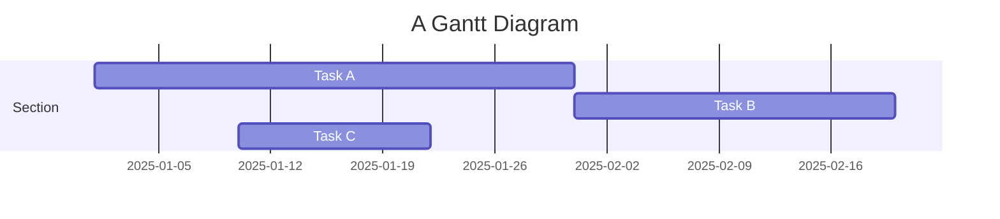
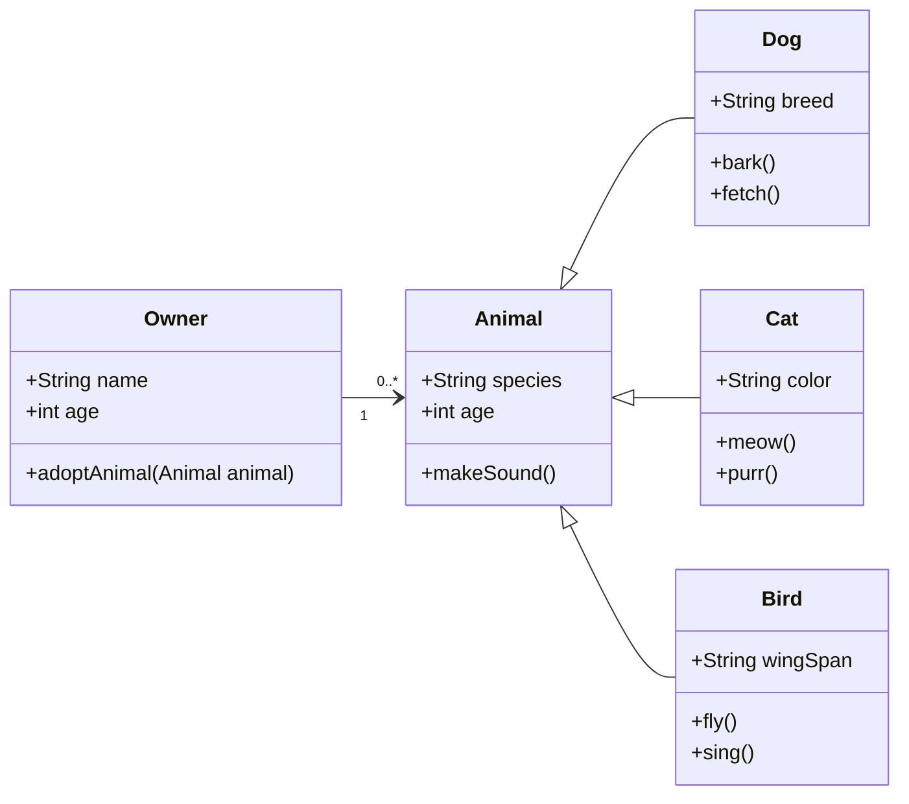

## Basics

Delivering a <a href="https://en.wikipedia.org/wiki/Cold-pressed_juice">cold-pressed</a> hyperlink in a sentence.

#### Check List

- [x] Brush Teeth
- [ ] Put on socks
  - [x] Put on left sock

#### Quote

> We do not grow absolutely, chronologically. We grow sometimes in one dimension, and not in another, unevenly. We grow partially. We are relative. We are mature in one realm, childish in another.
> —Anais Nin

#### Emphasize Tag

The emphasize tag should _italicize_ text.

#### Insert Tag

This tag should denote <ins>inserted</ins> text.

#### Keyboard Tag

This scarcely known tag emulates <kbd>keyboard text</kbd>, which is usually styled like the `<code>` tag.


#### Address Tag

<address>
  1 Infinite Loop<br /> Cupertino, CA 95014<br /> United States
</address>

#### Anchor Tag (aka. Link)

This is an example of a [link](http://github.com "GitHub").

#### Abbreviation Tag

The abbreviation CSS stands for "Cascading Style Sheets".

*[CSS]: Cascading Style Sheets

### Preformatted Tag

This tag styles large blocks of code.

<pre>
.post-title {
  margin: 0 0 5px;
  font-weight: bold;
  font-size: 38px;
  line-height: 1.2;
  and here's a line of some really, really, really, really long text, just to see how the PRE tag handles it and to find out how it overflows;
}
</pre>

#### Quote Tag

<q>Developers, developers, developers&#8230;</q> &#8211;Steve Ballmer

#### Strike Tag

This tag will let you <strike>strikeout text</strike>.

#### Strong Tag

This tag shows **bold text**.

#### Subscript Tag

Getting our science styling on with H<sub>2</sub>O, which should push the "2" down.

#### Superscript Tag

Still sticking with science and Isaac Newton's E = MC<sup>2</sup>, which should lift the 2 up.

#### Variable Tag

This allows you to denote <var>variables</var>.

#### Buttons

Make any link standout more when applying the `.btn` class. `cool.btn`


---
## Citations

Citations are then used in the article body with the `<d-cite>` tag.
The key attribute is a reference to the id provided in the bibliography.
The key attribute can take multiple ids, separated by commas.

The citation is presented inline like this: <d-cite key="gregor2015draw"></d-cite> (a number that displays more information on hover).
If you have an appendix, a bibliography is automatically created and populated in it.

Distill chose a numerical inline citation style to improve readability of citation dense articles and because many of the benefits of longer citations are obviated by displaying more information on hover.
However, we consider it good style to mention author last names if you discuss something at length and it fits into the flow well — the authors are human and it’s nice for them to have the community associate them with their work.

"Code is poetry." ---<cite>Automattic</cite>

---

## Footnotes

Just wrap the text you would like to show up in a footnote in a `<d-footnote>` tag.
The number of the footnote will be automatically generated.<d-footnote>This will become a hoverable footnote.</d-footnote>

---

## Code Blocks

You can also write standard Markdown code blocks in triple ticks with a language tag, for instance:

```python
def foo(x):
  return x
```

1. We can put fenced code blocks inside nested bullets, too.

   1. Like this:

      ```c
      printf("Hello, World!");
      ```

   2. The key is to indent your fenced block in the same line as the first character of the line.

---

## Details boxes

Details boxes are collapsible boxes which hide additional information from the user. They can be added with the `details` liquid tag:


Additional details, where math $$ 2x - 1 $$ and `code` is rendered correctly.


---

## Mermaid

This theme supports creating diagrams directly in markdown using [Mermaid](https://mermaid.js.org/). Mermaid enables users to render flowcharts, sequence diagrams, class diagrams, Gantt charts, and more. Simply embed the diagram syntax within a mermaid code block.

To create a Gantt chart, you can use the following syntax:

````markdown

````


Similarly, you can also use it to create beautiful class diagrams:


It will be presented as:



With Mermaid, you can easily add clear and dynamic diagrams to enhance your blog content.

---


## Sidenotes

Distill supports sidenotes, which are like footnotes but placed in the margin of the page.
They are useful for providing additional context or references without interrupting the flow of the main text.

There are two main ways to create a sidenote:

**Using the `<aside>` tag:**

The following code creates a sidenote with **_distill's styling_** in the margin:

```html
<aside><p>This is a sidenote using aside tag.</p></aside>
```

<aside><p> This is a sidenote using `&lt;aside&gt;` tag</p> </aside>

We can also add images to sidenotes (click on the image to zoom in for a larger version):


```html
<aside>
  
  <p>
    F.J. Cole, “The History of Albrecht Dürer’s Rhinoceros in Zoological Literature,” Science, Medicine, and History: Essays on the Evolution of
    Scientific Thought and Medical Practice (London, 1953), ed. E. Ashworth Underwood, 337-356. From page 71 of Edward Tufte’s Visual Explanations.
  </p>
</aside>
```



<aside>
  
  <p>F.J. Cole, “The History of Albrecht Dürer’s Rhinoceros in Zoological Literature,” Science, Medicine, and History: Essays on the Evolution of Scientific Thought and Medical Practice (London, 1953), ed. E. Ashworth Underwood, 337-356. From page 71 of Edward Tufte’s Visual Explanations.</p>
</aside>

Sidenotes can also contain equations and links:

In physics, mass–energy equivalence is the relationship between mass and energy in a system's rest frame. The two differ only by a multiplicative constant and the units of measurement.

<aside>
  <p>This principle is defined by Einstein's famous equation: $E = mc^2$ <a href="https://en.wikipedia.org/wiki/Mass%E2%80%93energy_equivalence" target="_blank">(Source: Wikipedia)</a></p>
</aside>

**Using the `l-gutter` class:**

The following code creates a sidenote with **_al-folio's styling_** in the margin:

```html
<div class="l-gutter"><p>This is a sidenote using l-gutter class.</p></div>
```

<div class="l-gutter">
  <p> This is a sidenote using `l-gutter` class. </p>
</div>

---

## Other Typography?

Emphasis, aka italics, with _asterisks_ (`*asterisks*`) or _underscores_ (`_underscores_`).

Strong emphasis, aka bold, with **asterisks** or **underscores**.

Combined emphasis with **asterisks and _underscores_**.

Strikethrough uses two tildes. ~~Scratch this.~~

1. First ordered list item
2. Another item
   ⋅⋅\* Unordered sub-list.
3. Actual numbers don't matter, just that it's a number
   ⋅⋅1. Ordered sub-list
4. And another item.

⋅⋅⋅You can have properly indented paragraphs within list items. Notice the blank line above, and the leading spaces (at least one, but we'll use three here to also align the raw Markdown).

⋅⋅⋅To have a line break without a paragraph, you will need to use two trailing spaces.⋅⋅
⋅⋅⋅Note that this line is separate, but within the same paragraph.⋅⋅
⋅⋅⋅(This is contrary to the typical GFM line break behaviour, where trailing spaces are not required.)

- Unordered list can use asterisks

* Or minuses

- Or pluses

[I'm an inline-style link](https://www.google.com)

[I'm an inline-style link with title](https://www.google.com "Google's Homepage")

[I'm a reference-style link][Arbitrary case-insensitive reference text]

[You can use numbers for reference-style link definitions][1]

Or leave it empty and use the [link text itself].

URLs and URLs in angle brackets will automatically get turned into links.
http://www.example.com or <http://www.example.com> and sometimes
example.com (but not on Github, for example).

Some text to show that the reference links can follow later.

[arbitrary case-insensitive reference text]: https://www.mozilla.org
[1]: http://slashdot.org
[link text itself]: http://www.reddit.com

Here's our logo (hover to see the title text):

Inline-style:


Reference-style:
![alt text][logo]

[logo]: https://github.com/adam-p/markdown-here/raw/master/src/common/images/icon48.png "Logo Title Text 2"

Inline `code` has `back-ticks around` it.

Python:

```python
print('Hello World!')
```

or GDscript

```gdscript
func _init():
	print("Hello, world!")
```

or Inform7

```inform7
Upon game start:
	say "Hello World"
```

```
No language indicated, so no syntax highlighting.
But let's throw in a <b>tag</b>.
```


# Lets do Tabs with this to be extra cool!



```inform7
Upon game start:
	say "Hello World"
```


```gdscript
func _init():
	print("Hello, world!")
```


```python
print('Hello World!')
```



## Another example





```yaml
hello:
  - "whatsup"
  - "hi"
```





```json
{
  "hello": ["whatsup", "hi"]
}
```





Colons can be used to align columns.

| Tables        |      Are      |  Cool |
| ------------- | :-----------: | ----: |
| col 3 is      | right-aligned | $1600 |
| col 2 is      |   centered    |   $12 |
| zebra stripes |   are neat    |    $1 |

There must be at least 3 dashes separating each header cell.
The outer pipes (|) are optional, and you don't need to make the
raw Markdown line up prettily. You can also use inline Markdown.

| Markdown | Less      | Pretty     |
| -------- | --------- | ---------- |
| _Still_  | `renders` | **nicely** |
| 1        | 2         | 3          |

> Blockquotes are very handy in email to emulate reply text.
> This line is part of the same quote.

Quote break.

> This is a very long line that will still be quoted properly when it wraps. Oh boy let's keep writing to make sure this is long enough to actually wrap for everyone. Oh, you can _put_ **Markdown** into a blockquote.

Here's a line for us to start with.

This line is separated from the one above by two newlines, so it will be a _separate paragraph_.

This line is also a separate paragraph, but...
This line is only separated by a single newline, so it's a separate line in the _same paragraph_.
