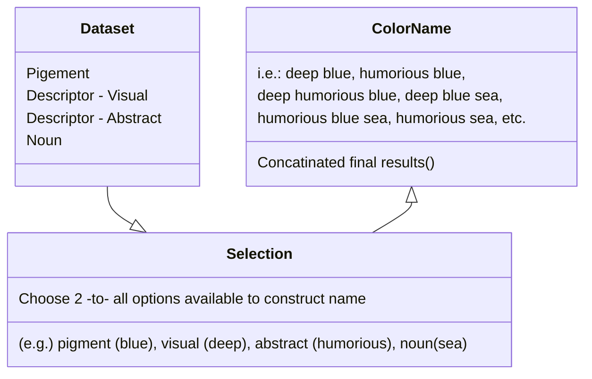

## Basics

Delivering a <a href="https://en.wikipedia.org/wiki/Cold-pressed_juice">cold-pressed</a> hyperlink in a sentence.

#### Quote

> We do not grow absolutely, chronologically. We grow sometimes in one dimension, and not in another, unevenly. We grow partially. We are relative. We are mature in one realm, childish in another.
> —Anais Nin

>  Oh, you can _put_ **Markdown** into a blockquote too.


#### Emphasize Tag

The emphasize tag should _italicize_ text.

#### Insert Tag

This tag should denote <ins>inserted</ins> text.

#### Keyboard Tag

This scarcely known tag emulates <kbd>keyboard text</kbd>, which is usually styled like the `<code>` tag.


#### Anchor Tag (aka. Link)

This is an example of a [link](http://github.com "GitHub").

#### Abbreviation Tag

The abbreviation CSS stands for "Cascading Style Sheets".

*[CSS]: Cascading Style Sheets


#### Quote Tag

<q>Developers, developers, developers&#8230;</q> &#8211;Steve Ballmer


#### Strong Tag

This tag shows **bold text**.

#### Buttons

Make any link standout more when applying the `.btn` class. `cool.btn`
[Link button](https://just-the-docs.com){: .btn }

---
## Citations

Citations are then used in the article body with the `<d-cite>` tag.
The key attribute is a reference to the id provided in the bibliography.
The key attribute can take multiple ids, separated by commas.

The citation is presented inline like this: <d-cite key="gregor2015draw"></d-cite> (a number that displays more information on hover).
If you have an appendix, a bibliography is automatically created and populated in it.

Distill chose a numerical inline citation style to improve readability of citation dense articles and because many of the benefits of longer citations are obviated by displaying more information on hover.
However, we consider it good style to mention author last names if you discuss something at length and it fits into the flow well — the authors are human and it’s nice for them to have the community associate them with their work.

"Code is poetry." ---<cite>Automattic</cite>

---

## Footnotes

Just wrap the text you would like to show up in a footnote in a `<d-footnote>` tag.
The number of the footnote will be automatically generated.<d-footnote>This will become a hoverable footnote.</d-footnote>

---

## Code Blocks

You can also write standard Markdown code blocks in triple ticks with a language tag, for instance:

```python
def foo(x):
  return x
```


## Mermaid

Similarly, you can also use it to create beautiful class diagrams:


It will be presented as:



With Mermaid, you can easily add clear and dynamic diagrams to enhance your blog content.

---


## Sidenotes

Distill supports sidenotes, which are like footnotes but placed in the margin of the page.
They are useful for providing additional context or references without interrupting the flow of the main text.

There are two main ways to create a sidenote:

**Using the `<aside>` tag:**

The following code creates a sidenote with **_distill's styling_** in the margin:

```html
<aside><p>This is a sidenote using aside tag.</p></aside>
```

<aside><p> This is a sidenote using `&lt;aside&gt;` tag</p> </aside>

We can also add images to sidenotes (click on the image to zoom in for a larger version):


```html
<aside>
  
  <p>
    F.J. Cole, “The History of Albrecht Dürer’s Rhinoceros in Zoological Literature,” Science, Medicine, and History: Essays on the Evolution of
    Scientific Thought and Medical Practice (London, 1953), ed. E. Ashworth Underwood, 337-356. From page 71 of Edward Tufte’s Visual Explanations.
  </p>
</aside>
```



<aside>
  
  <p>F.J. Cole, “The History of Albrecht Dürer’s Rhinoceros in Zoological Literature,” Science, Medicine, and History: Essays on the Evolution of Scientific Thought and Medical Practice (London, 1953), ed. E. Ashworth Underwood, 337-356. From page 71 of Edward Tufte’s Visual Explanations.</p>
</aside>

Sidenotes can also contain equations and links:

In physics, mass–energy equivalence is the relationship between mass and energy in a system's rest frame. The two differ only by a multiplicative constant and the units of measurement.

<aside>
  <p>This principle is defined by Einstein's famous equation: $E = mc^2$ <a href="https://en.wikipedia.org/wiki/Mass%E2%80%93energy_equivalence" target="_blank">(Source: Wikipedia)</a></p>
</aside>

**Using the `l-gutter` class:**

The following code creates a sidenote with **_al-folio's styling_** in the margin:

```html
<div class="l-gutter"><p>This is a sidenote using l-gutter class.</p></div>
```

<div class="l-gutter">
  <p> This is a sidenote using `l-gutter` class. </p>
</div>

---

## Other Typography?


[I'm an inline-style link with title](https://www.google.com "Google's Homepage")

[I'm a reference-style link][Arbitrary case-insensitive reference text]

[You can use numbers for reference-style link definitions][1]

Or leave it empty and use the [link text itself].

Some text to show that the reference links can follow later.

[arbitrary case-insensitive reference text]: https://www.mozilla.org
[1]: http://slashdot.org
[link text itself]: http://www.reddit.com


Inline `code` has `back-ticks around` it.

Python:

```python
print('Hello World!')
```

or GDscript

```gdscript
func _init():
	print("Hello, world!")
```

or Inform7

```infosrm7
Upon game start:
	say "Hello World"
```

```
No language indicated, so no syntax highlighting.
But let's throw in a <b>tag</b>.
```


# Lets do Tabs with this to be extra cool!
But we are also putting the code in a details drop down




```Rust
//Importing the rand crate to give us easy access to random function macros.
use rand::prelude::*;

//Creating some name arrays of data to pull from to create our random names 16x16
const FORNAMES: &[&str] = &[
    "atstrid",
    "douglas",
    "elizabeth",
    "ellen",
    "esther",
    "henry",
    "mark",
    "mary",
    "mia",
    "nico",
    "opal",
    "raki",
    "sebastián",
    "thom",
    "victoria",
    "wendy",
];

const SURNAMES: &[&str] = &[
    "appleton",
    "azarov",
    "babbage",
    "blackwell",
    "bloom",
    "button",
    "conway",
    "devi",
    "garcia",
    "harris",
    "kozuki",
    "lowell",
    "müller",
    "quinlan",
    "satō",
    "thimble",
];

    //It's strangly obtuse to capitalize the first letter of a string in Rust, we have to break it apart and then reconcatinate it so heres a function to do just that
fn capitalize(s: &str) -> String {
    if s.is_empty() {
        return s.to_string();
    }
    let mut chars = s.chars();
    let first_char = chars.next().unwrap();
    let capitalized_first: String = first_char.to_uppercase().collect();
    let rest: String = chars.collect();
    format!("{}{}", capitalized_first, rest)
}

//Here's our main function
fn main() {
    let mut rng = rand::rng();
        //Loop the code 5 times so we can get five different results
    for _i in 0..5
    { 
        // added the capitalize to surname. It seems you encapsulate a into other functions, not sure how to do that with external code referencesationthe 
    let namez = format!("{} {}", capitalize(FORNAMES.choose(&mut rng).unwrap()), capitalize(SURNAMES.choose(&mut rng).unwrap()));
    println!("{namez}");
    }
}
```




```Inform 7
func _init():
	Adding Inform 7 example.
```


```python
print('I am still adding a python variant for this example!')
```





Maybe this is what was causing issues.


Here is the web player of the rust code in action that you can run yourselfs!
 <iframe src="https://play.rust-lang.org/?version=stable&mode=debug&edition=2024&code=%0A%2F%2FImporting+the+rand+crate+to+give+us+easy+access+to+random+function+macros.%0Ause+rand%3A%3Aprelude%3A%3A*%3B%0A%0A%2F%2FCreating+some+name+arrays+of+data+to+pull+from+to+create+our+random+names+16x16%0Aconst+FORNAMES%3A+%26%5B%26str%5D+%3D+%26%5B%0A++++%22atstrid%22%2C%0A++++%22douglas%22%2C%0A++++%22elizabeth%22%2C%0A++++%22ellen%22%2C%0A++++%22esther%22%2C%0A++++%22henry%22%2C%0A++++%22mark%22%2C%0A++++%22mary%22%2C%0A++++%22mia%22%2C%0A++++%22nico%22%2C%0A++++%22opal%22%2C%0A++++%22raki%22%2C%0A++++%22sebasti%C3%A1n%22%2C%0A++++%22thom%22%2C%0A++++%22victoria%22%2C%0A++++%22wendy%22%2C%0A%5D%3B%0A%0Aconst+SURNAMES%3A+%26%5B%26str%5D+%3D+%26%5B%0A++++%22appleton%22%2C%0A++++%22azarov%22%2C%0A++++%22babbage%22%2C%0A++++%22blackwell%22%2C%0A++++%22bloom%22%2C%0A++++%22button%22%2C%0A++++%22conway%22%2C%0A++++%22devi%22%2C%0A++++%22garcia%22%2C%0A++++%22harris%22%2C%0A++++%22kozuki%22%2C%0A++++%22lowell%22%2C%0A++++%22m%C3%BCller%22%2C%0A++++%22quinlan%22%2C%0A++++%22sat%C5%8D%22%2C%0A++++%22thimble%22%2C%0A%5D%3B%0A%0A++++%2F%2FIt%27s+strangly+obtuse+to+capitalize+the+first+letter+of+a+string+in+Rust%2C+we+have+to+break+it+apart+and+then+reconcatinate+it+so+heres+a+function+to+do+just+that%0Afn+capitalize%28s%3A+%26str%29+-%3E+String+%7B%0A++++if+s.is_empty%28%29+%7B%0A++++++++return+s.to_string%28%29%3B%0A++++%7D%0A++++let+mut+chars+%3D+s.chars%28%29%3B%0A++++let+first_char+%3D+chars.next%28%29.unwrap%28%29%3B%0A++++let+capitalized_first%3A+String+%3D+first_char.to_uppercase%28%29.collect%28%29%3B%0A++++let+rest%3A+String+%3D+chars.collect%28%29%3B%0A++++format%21%28%22%7B%7D%7B%7D%22%2C+capitalized_first%2C+rest%29%0A%7D%0A%0A%2F%2FHere%27s+our+main+function%0Afn+main%28%29+%7B%0A++++let+mut+rng+%3D+rand%3A%3Arng%28%29%3B%0A++++++++%2F%2FLoop+the+code+5+times+so+we+can+get+five+different+results%0A++++for+_i+in+0..5%0A++++%7B+%0A++++++++%2F%2F+added+the+capitalize+to+surname.+It+seems+you+encapsulate+a+into+other+functions%2C+not+sure+how+to+do+that+with+external+code+referencesationthe+%0A++++let+namez+%3D+format%21%28%22%7B%7D+%7B%7D%22%2C+capitalize%28FORNAMES.choose%28%26mut+rng%29.unwrap%28%29%29%2C+capitalize%28SURNAMES.choose%28%26mut+rng%29.unwrap%28%29%29%29%3B%0A++++println%21%28%22%7Bnamez%7D%22%29%3B%0A++++%7D%0A%7D" title="Rust Basic Names"></iframe> 

## Another example





```yaml
hello:
  - "whatsup"
  - "hi"
```





```json
{
  "hello": ["whatsup", "hi"]
}
```






| Firstname | surname | surname | filler | descriptor | reputation | filler | descriptor | place |
| --------- | ------- | ------- | ------ | ---------- | ---------- | ------ | ---------- | ----- |
| Wendy     | Red     | bells   | the    | Dark       | Tyrant     | of the | Deep       | Mauw  |


