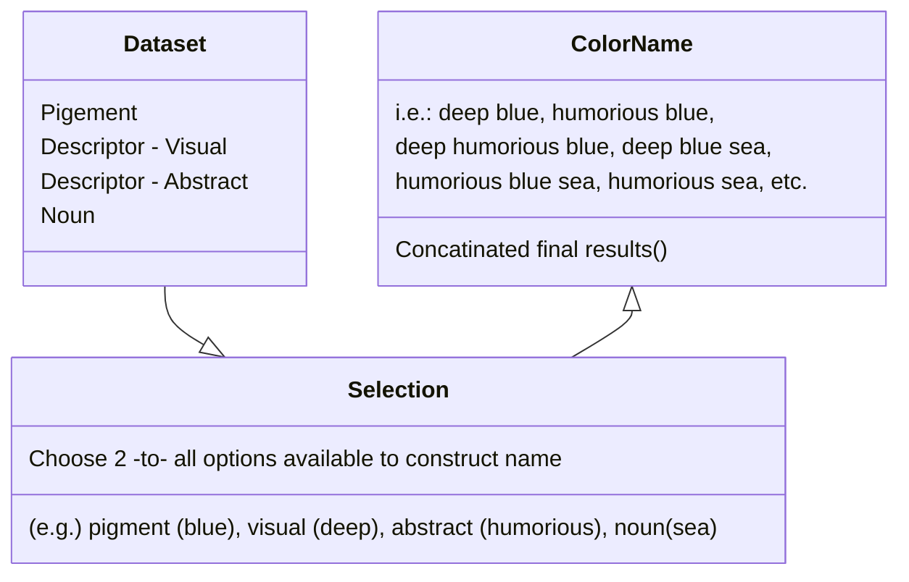

## Basics

Delivering a <a href="https://en.wikipedia.org/wiki/Cold-pressed_juice">cold-pressed</a> hyperlink in a sentence.

#### Quote

> We do not grow absolutely, chronologically. We grow sometimes in one dimension, and not in another, unevenly. We grow partially. We are relative. We are mature in one realm, childish in another.
> —Anais Nin

In truth we are non homogeneous beings in all aspects and temporal elements, why do we veiw things in binary why do we act so?

>  Oh, you can _put_ **Markdown** into a blockquote too.


#### Emphasize Tag

The emphasize tag should _italicize_ text.

#### Insert Tag

This tag should denote <ins>inserted</ins> text.

#### Keyboard Tag

This scarcely known tag emulates <kbd>keyboard text</kbd>, which is usually styled like the `<code>` tag.


#### Anchor Tag (aka. Link)

This is an example of a [link](http://github.com "GitHub").

#### Abbreviation Tag

The abbreviation CSS stands for "Cascading Style Sheets".

*[CSS]: Cascading Style Sheets


#### Quote Tag

<q>Developers, developers, developers&#8230;</q> &#8211;Steve Ballmer


#### Strong Tag

This tag shows **bold text**.

#### Buttons

Make any link standout more when applying the `.btn` class. `cool.btn`
[Link button](https://just-the-docs.com){: .btn }

---
## Citations

Citations are then used in the article body with the `<d-cite>` tag.
The key attribute is a reference to the id provided in the bibliography.
The key attribute can take multiple ids, separated by commas.

The citation is presented inline like this: <d-cite key="gregor2015draw"></d-cite> (a number that displays more information on hover).
If you have an appendix, a bibliography is automatically created and populated in it.

Distill chose a numerical inline citation style to improve readability of citation dense articles and because many of the benefits of longer citations are obviated by displaying more information on hover.
However, we consider it good style to mention author last names if you discuss something at length and it fits into the flow well — the authors are human and it’s nice for them to have the community associate them with their work.

"Code is poetry." ---<cite>Automattic</cite>

---

## Footnotes

Just wrap the text you would like to show up in a footnote in a `<d-footnote>` tag.
The number of the footnote will be automatically generated.<d-footnote>This will become a hoverable footnote.That you can fill with relevence.</d-footnote>

---

## Mermaid

Similarly, you can also use it to create beautiful class diagrams:


It will be presented as:



A quick diagram on how we might construct a paint namer.
---


## Sidenotes

Distill supports sidenotes, which are like footnotes but placed in the margin of the page.
They are useful for providing additional context or references without interrupting the flow of the main text.

There are two main ways to create a sidenote:

**Using the `<aside>` tag:**

The following code creates a sidenote with **_distill's styling_** in the margin:

```html
<aside><p>This is a sidenote using aside tag.</p></aside>
```

<aside><p> This is a sidenote using `&lt;aside&gt;` tag</p> </aside>

We can also add images to sidenotes (click on the image to zoom in for a larger version):


```html
<aside>
  
  <p>
    F.J. Cole, “The History of Albrecht Dürer’s Rhinoceros in Zoological Literature,” Science, Medicine, and History: Essays on the Evolution of
    Scientific Thought and Medical Practice (London, 1953), ed. E. Ashworth Underwood, 337-356. From page 71 of Edward Tufte’s Visual Explanations.
  </p>
</aside>
```



<aside>
  
  <p>F.J. Cole, “The History of Albrecht Dürer’s Rhinoceros in Zoological Literature,” Science, Medicine, and History: Essays on the Evolution of Scientific Thought and Medical Practice (London, 1953), ed. E. Ashworth Underwood, 337-356. From page 71 of Edward Tufte’s Visual Explanations.</p>
   <p>This principle is defined by Einstein's famous equation: $E = mc^2$ <a href="https://en.wikipedia.org/wiki/Mass%E2%80%93energy_equivalence" target="_blank">(Source: Wikipedia)</a></p>
</aside>


## Other Typography?


[I'm an inline-style link with title](https://www.google.com "Google's Homepage")

[I'm a reference-style link][Arbitrary case-insensitive reference text]

[You can use numbers for reference-style link definitions][1]

Or leave it empty and use the [link text itself].

Some text to show that the reference links can follow later.

[arbitrary case-insensitive reference text]: https://www.mozilla.org
[1]: http://slashdot.org
[link text itself]: http://www.reddit.com


Inline `code` has `back-ticks around` it.


# Lets do Tabs with this to be extra cool!
But we are also putting the code in a details drop down!





```rust
//Importing the rand crate to give us easy access to random function macros.
use rand::prelude::*;

//Creating some name arrays of data to pull from to create our random names 16x16
const FORNAMES: &[&str] = &[
    "atstrid",
    "douglas",
    "elizabeth",
    "ellen",
    "esther",
    "henry",
    "mark",
    "mary",
    "mia",
    "nico",
    "opal",
    "raki",
    "sebastián",
    "thom",
    "victoria",
    "wendy",
];

const SURNAMES: &[&str] = &[
    "appleton",
    "azarov",
    "babbage",
    "blackwell",
    "bloom",
    "button",
    "conway",
    "devi",
    "garcia",
    "harris",
    "kozuki",
    "lowell",
    "müller",
    "quinlan",
    "satō",
    "thimble",
];

    //It's strangly obtuse to capitalize the first letter of a string in Rust, we have to break it apart and then reconcatinate it so heres a function to do just that
fn capitalize(s: &str) -> String {
    if s.is_empty() {
        return s.to_string();
    }
    let mut chars = s.chars();
    let first_char = chars.next().unwrap();
    let capitalized_first: String = first_char.to_uppercase().collect();
    let rest: String = chars.collect();
    format!("{}{}", capitalized_first, rest)
}

//Here's our main function
fn main() {
    let mut rng = rand::rng();
        //Loop the code 5 times so we can get five different results
    for _i in 0..5
    { 
        // added the capitalize to surname. It seems you encapsulate a into other functions, not sure how to do that with external code referencesationthe 
    let namez = format!("{} {}", capitalize(FORNAMES.choose(&mut rng).unwrap()), capitalize(SURNAMES.choose(&mut rng).unwrap()));
    println!("{namez}");
    }
}
```



<iframe src="https://play.rust-lang.org/?version=stable&mode=debug&edition=2024&code=%0A%2F%2FImporting+the+rand+crate+to+give+us+easy+access+to+random+function+macros.%0Ause+rand%3A%3Aprelude%3A%3A*%3B%0A%0A%2F%2FCreating+some+name+arrays+of+data+to+pull+from+to+create+our+random+names+16x16%0Aconst+FORNAMES%3A+%26%5B%26str%5D+%3D+%26%5B%0A++++%22atstrid%22%2C%0A++++%22douglas%22%2C%0A++++%22elizabeth%22%2C%0A++++%22ellen%22%2C%0A++++%22esther%22%2C%0A++++%22henry%22%2C%0A++++%22mark%22%2C%0A++++%22mary%22%2C%0A++++%22mia%22%2C%0A++++%22nico%22%2C%0A++++%22opal%22%2C%0A++++%22raki%22%2C%0A++++%22sebasti%C3%A1n%22%2C%0A++++%22thom%22%2C%0A++++%22victoria%22%2C%0A++++%22wendy%22%2C%0A%5D%3B%0A%0Aconst+SURNAMES%3A+%26%5B%26str%5D+%3D+%26%5B%0A++++%22appleton%22%2C%0A++++%22azarov%22%2C%0A++++%22babbage%22%2C%0A++++%22blackwell%22%2C%0A++++%22bloom%22%2C%0A++++%22button%22%2C%0A++++%22conway%22%2C%0A++++%22devi%22%2C%0A++++%22garcia%22%2C%0A++++%22harris%22%2C%0A++++%22kozuki%22%2C%0A++++%22lowell%22%2C%0A++++%22m%C3%BCller%22%2C%0A++++%22quinlan%22%2C%0A++++%22sat%C5%8D%22%2C%0A++++%22thimble%22%2C%0A%5D%3B%0A%0A++++%2F%2FIt%27s+strangly+obtuse+to+capitalize+the+first+letter+of+a+string+in+Rust%2C+we+have+to+break+it+apart+and+then+reconcatinate+it+so+heres+a+function+to+do+just+that%0Afn+capitalize%28s%3A+%26str%29+-%3E+String+%7B%0A++++if+s.is_empty%28%29+%7B%0A++++++++return+s.to_string%28%29%3B%0A++++%7D%0A++++let+mut+chars+%3D+s.chars%28%29%3B%0A++++let+first_char+%3D+chars.next%28%29.unwrap%28%29%3B%0A++++let+capitalized_first%3A+String+%3D+first_char.to_uppercase%28%29.collect%28%29%3B%0A++++let+rest%3A+String+%3D+chars.collect%28%29%3B%0A++++format%21%28%22%7B%7D%7B%7D%22%2C+capitalized_first%2C+rest%29%0A%7D%0A%0A%2F%2FHere%27s+our+main+function%0Afn+main%28%29+%7B%0A++++let+mut+rng+%3D+rand%3A%3Arng%28%29%3B%0A++++++++%2F%2FLoop+the+code+5+times+so+we+can+get+five+different+results%0A++++for+_i+in+0..5%0A++++%7B+%0A++++++++%2F%2F+added+the+capitalize+to+surname.+It+seems+you+encapsulate+a+into+other+functions%2C+not+sure+how+to+do+that+with+external+code+referencesationthe+%0A++++let+namez+%3D+format%21%28%22%7B%7D+%7B%7D%22%2C+capitalize%28FORNAMES.choose%28%26mut+rng%29.unwrap%28%29%29%2C+capitalize%28SURNAMES.choose%28%26mut+rng%29.unwrap%28%29%29%29%3B%0A++++println%21%28%22%7Bnamez%7D%22%29%3B%0A++++%7D%0A%7D" height="600" width="550" title="Rust Basic Names"></iframe> 









Here is the web player of the rust code in action that you can run yourselfs!
 
## Another example








```rust

//First, let's import some rand crate macros because we are going to be using a lot of random choice selection and bool generation
use rand::prelude::*;
use rand::random;

//I have made a few constant arrays to store a few different word pools, the first of which is an awkward attempt to make a simple concatenating forename generator
const FIRST_PARTS_ONE: &[&str] = &["bright", "rach", "mary", "wet", "shel", "dear", "alk", "er", "sher", "zor"];
const FIRST_PARTS_TWO: &[&str] = &["ton", "al", "es", "son", "ler", "win"];

const LAST_PARTS_ONE: &[&str] = &["willow", "bloom", "fair", "storm", "love", "ember", "vale", "deep", "dark", "black", "red", "true", "brass"];
const LAST_PARTS_TWO: &[&str] = &["miller", "fisher", "ton", "gate", "stich", "bell", "thimble", "smith", "craft", "weather", "wright"];

const FORNAME_SINGLE: &[&str] = &["atstrid", "douglas", "elizabeth", "esther", "nico", "opal", "sebastián", "victoria", "wendy", "zoe", "harper", "kim", "morgan", "addison", "robin", "jing",];
const SURNAME_SINGLE: &[&str] = &["acuña", "aoki", "babbage", "blackwell", "conway", "eldridge", "erdős", "fazil", "fuller", "garcia", "harris", "kozuki", "lowell", "müller", "naccarato", "nzuyen","quinlan", "satō","tsai", "wagner", "zote",];

//function to generate a first and last name that references a bool if to select single names or concatenated names for fore/surnames.
fn generate_name() -> String {
    let mut rng = rand::rng();
    let use_two = random(); // Hey it's a bool generator into an if else statement, the bool is the condition - if true, the name will be two words concatenated
    let first_name = if use_two {
    format!(
        "{}{}",
        capitalize(FIRST_PARTS_ONE.choose(&mut rng).unwrap()), //passing the first section to the capitalization function.
        FIRST_PARTS_TWO.choose(&mut rng).unwrap())
    } else {
        capitalize(FORNAME_SINGLE.choose(&mut rng).unwrap())
    };
    //And again lets set it to random if it's one or two words concatenated to a surname
    let use_two = random();
    let last_name = if use_two {
    format!(
        "{}{}",
        capitalize(LAST_PARTS_ONE.choose(&mut rng).unwrap()),
        LAST_PARTS_TWO.choose(&mut rng).unwrap())
    } else {
       capitalize(SURNAME_SINGLE.choose(&mut rng).unwrap())
    };
    //Finally, we now add the two chosen/constructed names to the final name combining the first and last name.
    format!("{} {}", first_name, last_name)
}

    //My wonky capitalizer function that I keep running into borrowing string type headaches
fn capitalize(s: &str) -> String {
    if s.is_empty() {
        return s.to_string();
    }
    let mut chars = s.chars();
    let first_char = chars.next().unwrap(); //Basically, it splits off the first character, capitalizes it, and then reassembles it.
    let capitalized_first: String = first_char.to_uppercase().collect();
    let rest: String = chars.collect();
    format!("{}{}", capitalized_first, rest)
}

fn main() {
    for _ in 00..5{ // Nesting our result in a loop * 5 so we can see a few variants
        //Now we call the name (generate_name) function and then print the results!
        let name = generate_name();
        println!("{}", name);
    }
}
```




<iframe src="https://play.rust-lang.org/?version=stable&mode=debug&edition=2024&code=%2F%2FFirst%2C+let%27s+import+rand+because+we+are+going+to+be+using+a+lot+of+random+choice+selection+and+bool+generation%0Ause+rand%3A%3Aprelude%3A%3A*%3B%0Ause+rand%3A%3Arandom%3B%0A%0A%2F%2FI+have+made+a+few+constant+arrays+to+store+a+few+different+word+pools%2C+the+first+of+which+is+an+awkward+attempt+to+make+a+simple+concatenating+forename+generator%0Aconst+FIRST_PARTS_ONE%3A+%26%5B%26str%5D+%3D+%26%5B%22bright%22%2C+%22rach%22%2C+%22mary%22%2C+%22wet%22%2C+%22shel%22%2C+%22dear%22%2C+%22alk%22%2C+%22er%22%2C+%22sher%22%2C+%22zor%22%5D%3B%0Aconst+FIRST_PARTS_TWO%3A+%26%5B%26str%5D+%3D+%26%5B%22ton%22%2C+%22al%22%2C+%22es%22%2C+%22son%22%2C+%22ler%22%2C+%22win%22%5D%3B%0A%0Aconst+LAST_PARTS_ONE%3A+%26%5B%26str%5D+%3D+%26%5B%22willow%22%2C+%22bloom%22%2C+%22fair%22%2C+%22storm%22%2C+%22love%22%2C+%22ember%22%2C+%22vale%22%2C+%22deep%22%2C+%22dark%22%2C+%22black%22%2C+%22red%22%2C+%22true%22%2C+%22brass%22%5D%3B%0Aconst+LAST_PARTS_TWO%3A+%26%5B%26str%5D+%3D+%26%5B%22miller%22%2C+%22fisher%22%2C+%22ton%22%2C+%22gate%22%2C+%22stich%22%2C+%22bell%22%2C+%22thimble%22%2C+%22smith%22%2C+%22craft%22%2C+%22weather%22%2C+%22wright%22%5D%3B%0A%0Aconst+FORNAME_SINGLE%3A+%26%5B%26str%5D+%3D+%26%5B%22atstrid%22%2C+%22douglas%22%2C+%22elizabeth%22%2C+%22esther%22%2C+%22nico%22%2C+%22opal%22%2C+%22sebasti%C3%A1n%22%2C+%22victoria%22%2C+%22wendy%22%2C+%22zoe%22%2C+%22harper%22%2C+%22kim%22%2C+%22morgan%22%2C+%22addison%22%2C+%22robin%22%2C+%22jing%22%2C%5D%3B%0Aconst+SURNAME_SINGLE%3A+%26%5B%26str%5D+%3D+%26%5B%22acu%C3%B1a%22%2C+%22aoki%22%2C+%22babbage%22%2C+%22blackwell%22%2C+%22conway%22%2C+%22eldridge%22%2C+%22erd%C5%91s%22%2C+%22fazil%22%2C+%22fuller%22%2C+%22garcia%22%2C+%22harris%22%2C+%22kozuki%22%2C+%22lowell%22%2C+%22m%C3%BCller%22%2C+%22naccarato%22%2C+%22nzuyen%22%2C%22quinlan%22%2C+%22sat%C5%8D%22%2C%22tsai%22%2C+%22wagner%22%2C+%22zote%22%2C%5D%3B%0A%0A%2F%2Ffunction+to+generate+a+first+and+last+name+that+references+a+bool+if+to+select+single+names+or+concatenated+names+for+fore%2Fsurnames.%0Afn+generate_name%28%29+-%3E+String+%7B%0A++++let+mut+rng+%3D+rand%3A%3Arng%28%29%3B%0A++++let+use_two+%3D+random%28%29%3B+%2F%2F+Hey+it%27s+a+bool+generator+into+an+if+else+statement%2C+the+bool+is+the+condition+-+if+true%2C+the+name+will+be+two+words+concatenated%0A++++let+first_name+%3D+if+use_two+%7B%0A++++format%21%28%0A++++++++%22%7B%7D%7B%7D%22%2C%0A++++++++capitalize%28FIRST_PARTS_ONE.choose%28%26mut+rng%29.unwrap%28%29%29%2C+%2F%2Fpassing+the+first+section+to+the+capitalization+function.%0A++++++++FIRST_PARTS_TWO.choose%28%26mut+rng%29.unwrap%28%29%29%0A++++%7D+else+%7B%0A++++++++capitalize%28FORNAME_SINGLE.choose%28%26mut+rng%29.unwrap%28%29%29%0A++++%7D%3B%0A++++%2F%2FAnd+again+lets+set+it+to+random+if+it%27s+one+or+two+words+concatenated+to+a+surname%0A++++let+use_two+%3D+random%28%29%3B%0A++++let+last_name+%3D+if+use_two+%7B%0A++++format%21%28%0A++++++++%22%7B%7D%7B%7D%22%2C%0A++++++++capitalize%28LAST_PARTS_ONE.choose%28%26mut+rng%29.unwrap%28%29%29%2C%0A++++++++LAST_PARTS_TWO.choose%28%26mut+rng%29.unwrap%28%29%29%0A++++%7D+else+%7B%0A+++++++capitalize%28SURNAME_SINGLE.choose%28%26mut+rng%29.unwrap%28%29%29%0A++++%7D%3B%0A++++%2F%2FFinally%2C+we+now+add+the+two+chosen%2Fconstructed+names+to+the+final+name+combining+the+first+and+last+name.%0A++++format%21%28%22%7B%7D+%7B%7D%22%2C+first_name%2C+last_name%29%0A%7D%0A%0A++++%2F%2FMy+wonky+capitalizer+function+that+I+keep+running+into+borrowing+string+type+headaches%0Afn+capitalize%28s%3A+%26str%29+-%3E+String+%7B%0A++++if+s.is_empty%28%29+%7B%0A++++++++return+s.to_string%28%29%3B%0A++++%7D%0A++++let+mut+chars+%3D+s.chars%28%29%3B%0A++++let+first_char+%3D+chars.next%28%29.unwrap%28%29%3B+%2F%2FBasically%2C+it+splits+off+the+first+character%2C+capitalizes+it%2C+and+then+reassembles+it.%0A++++let+capitalized_first%3A+String+%3D+first_char.to_uppercase%28%29.collect%28%29%3B%0A++++let+rest%3A+String+%3D+chars.collect%28%29%3B%0A++++format%21%28%22%7B%7D%7B%7D%22%2C+capitalized_first%2C+rest%29%0A%7D%0A%0Afn+main%28%29+%7B%0A++++for+_+in+00..5%7B+%2F%2F+Nesting+our+result+in+a+loop+*+5+so+we+can+see+a+few+variants%0A++++++++%2F%2FNow+we+call+the+name+%28generate_name%29+function+and+then+print+the+results%21%0A++++++++let+name+%3D+generate_name%28%29%3B%0A++++++++println%21%28%22%7B%7D%22%2C+name%29%3B%0A++++%7D%0A%7D" height="600" width="550" title="Rust Compound Names"></iframe> 





```rust
//First, let's import rand because we are going to be using a lot of random choice selection and bool generation
use rand::prelude::*;
use rand::random;

//I have made a few constant arrays to store a few different word pools, the first of which is an awkward attempt to make a simple concatenating forename generator
const FIRST_PARTS_ONE: &[&str] = &["bright", "rach", "mary", "wet", "shel", "dear", "alk", "er", "sher", "zor"];
const FIRST_PARTS_TWO: &[&str] = &["ton", "al", "es", "son", "ler", "win"];

const LAST_PARTS_ONE: &[&str] = &["willow", "bloom", "fair", "storm", "love", "ember", "vale", "deep", "dark", "black", "red", "true", "brass"];
const LAST_PARTS_TWO: &[&str] = &["miller", "fisher", "ton", "gate", "stich", "bell", "thimble", "smith", "craft", "weather", "wright"];

const FORNAME_SINGLE: &[&str] = &["atstrid", "douglas", "elizabeth", "esther", "nico", "opal", "sebastián", "victoria", "wendy", "zoe", "harper", "kim", "morgan", "addison", "robin", "jing",];
const SURNAME_SINGLE: &[&str] = &["acuña", "aoki", "babbage", "blackwell", "conway", "eldridge", "erdős", "fazil", "fuller", "garcia", "harris", "kozuki", "lowell", "müller", "naccarato", "nzuyen","quinlan", "satō","tsai", "wagner", "zote",];

//function to generate a first and last name that references a bool if to select single names or concatenated names for fore/surnames.
fn generate_name() -> String {
    let mut rng = rand::rng();
    let use_two = random(); // Hey it's a bool generator into an if else statement, the bool is the condition - if true, the name will be two words concatenated
    let first_name = if use_two {
    format!(
        "{}{}",
        capitalize(FIRST_PARTS_ONE.choose(&mut rng).unwrap()), //passing the first section to the capitalization function.
        FIRST_PARTS_TWO.choose(&mut rng).unwrap())
    } else {
        capitalize(FORNAME_SINGLE.choose(&mut rng).unwrap())
    };
    //And again lets set it to random if it's one or two words concatenated to a surname
    let use_two = random();
    let last_name = if use_two {
    format!(
        "{}{}",
        capitalize(LAST_PARTS_ONE.choose(&mut rng).unwrap()),
        LAST_PARTS_TWO.choose(&mut rng).unwrap())
    } else {
       capitalize(SURNAME_SINGLE.choose(&mut rng).unwrap())
    };
    //Finally, we now add the two chosen/constructed names to the final name combining the first and last name.
    format!("{} {}", first_name, last_name)
}

    //My wonky capitalizer function that I keep running into borrowing string type headaches
fn capitalize(s: &str) -> String {
    if s.is_empty() {
        return s.to_string();
    }
    let mut chars = s.chars();
    let first_char = chars.next().unwrap(); //Basically, it splits off the first character, capitalizes it, and then reassembles it.
    let capitalized_first: String = first_char.to_uppercase().collect();
    let rest: String = chars.collect();
    format!("{}{}", capitalized_first, rest)
}

fn main() {
    for _ in 00..5{ // Nesting our result in a loop * 5 so we can see a few variants
        //Now we call the name (generate_name) function and then print the results!
        let name = generate_name();
        println!("{}", name);
    }
}

```



<iframe src="https://play.rust-lang.org/?version=stable&mode=debug&edition=2024&code=%2F%2FFirst%2C+let%27s+import+rand+because+we+are+going+to+be+using+a+lot+of+random+choice+selection+and+bool+generation%0Ause+rand%3A%3Aprelude%3A%3A*%3B%0Ause+rand%3A%3Arandom%3B%0A%0A%2F%2FI+have+made+a+few+constant+arrays+to+store+a+few+different+word+pools%2C+the+first+of+which+is+an+awkward+attempt+to+make+a+simple+concatenating+forename+generator%0Aconst+FIRST_PARTS_ONE%3A+%26%5B%26str%5D+%3D+%26%5B%22bright%22%2C+%22rach%22%2C+%22mary%22%2C+%22wet%22%2C+%22shel%22%2C+%22dear%22%2C+%22alk%22%2C+%22er%22%2C+%22sher%22%2C+%22zor%22%5D%3B%0Aconst+FIRST_PARTS_TWO%3A+%26%5B%26str%5D+%3D+%26%5B%22ton%22%2C+%22al%22%2C+%22es%22%2C+%22son%22%2C+%22ler%22%2C+%22win%22%5D%3B%0A%0Aconst+LAST_PARTS_ONE%3A+%26%5B%26str%5D+%3D+%26%5B%22willow%22%2C+%22bloom%22%2C+%22fair%22%2C+%22storm%22%2C+%22love%22%2C+%22ember%22%2C+%22vale%22%2C+%22deep%22%2C+%22dark%22%2C+%22black%22%2C+%22red%22%2C+%22true%22%2C+%22brass%22%5D%3B%0Aconst+LAST_PARTS_TWO%3A+%26%5B%26str%5D+%3D+%26%5B%22miller%22%2C+%22fisher%22%2C+%22ton%22%2C+%22gate%22%2C+%22stich%22%2C+%22bell%22%2C+%22thimble%22%2C+%22smith%22%2C+%22craft%22%2C+%22weather%22%2C+%22wright%22%5D%3B%0A%0Aconst+FORNAME_SINGLE%3A+%26%5B%26str%5D+%3D+%26%5B%22atstrid%22%2C+%22douglas%22%2C+%22elizabeth%22%2C+%22esther%22%2C+%22nico%22%2C+%22opal%22%2C+%22sebasti%C3%A1n%22%2C+%22victoria%22%2C+%22wendy%22%2C+%22zoe%22%2C+%22harper%22%2C+%22kim%22%2C+%22morgan%22%2C+%22addison%22%2C+%22robin%22%2C+%22jing%22%2C%5D%3B%0Aconst+SURNAME_SINGLE%3A+%26%5B%26str%5D+%3D+%26%5B%22acu%C3%B1a%22%2C+%22aoki%22%2C+%22babbage%22%2C+%22blackwell%22%2C+%22conway%22%2C+%22eldridge%22%2C+%22erd%C5%91s%22%2C+%22fazil%22%2C+%22fuller%22%2C+%22garcia%22%2C+%22harris%22%2C+%22kozuki%22%2C+%22lowell%22%2C+%22m%C3%BCller%22%2C+%22naccarato%22%2C+%22nzuyen%22%2C%22quinlan%22%2C+%22sat%C5%8D%22%2C%22tsai%22%2C+%22wagner%22%2C+%22zote%22%2C%5D%3B%0A%0A%2F%2Ffunction+to+generate+a+first+and+last+name+that+references+a+bool+if+to+select+single+names+or+concatenated+names+for+fore%2Fsurnames.%0Afn+generate_name%28%29+-%3E+String+%7B%0A++++let+mut+rng+%3D+rand%3A%3Arng%28%29%3B%0A++++let+use_two+%3D+random%28%29%3B+%2F%2F+Hey+it%27s+a+bool+generator+into+an+if+else+statement%2C+the+bool+is+the+condition+-+if+true%2C+the+name+will+be+two+words+concatenated%0A++++let+first_name+%3D+if+use_two+%7B%0A++++format%21%28%0A++++++++%22%7B%7D%7B%7D%22%2C%0A++++++++capitalize%28FIRST_PARTS_ONE.choose%28%26mut+rng%29.unwrap%28%29%29%2C+%2F%2Fpassing+the+first+section+to+the+capitalization+function.%0A++++++++FIRST_PARTS_TWO.choose%28%26mut+rng%29.unwrap%28%29%29%0A++++%7D+else+%7B%0A++++++++capitalize%28FORNAME_SINGLE.choose%28%26mut+rng%29.unwrap%28%29%29%0A++++%7D%3B%0A++++%2F%2FAnd+again+lets+set+it+to+random+if+it%27s+one+or+two+words+concatenated+to+a+surname%0A++++let+use_two+%3D+random%28%29%3B%0A++++let+last_name+%3D+if+use_two+%7B%0A++++format%21%28%0A++++++++%22%7B%7D%7B%7D%22%2C%0A++++++++capitalize%28LAST_PARTS_ONE.choose%28%26mut+rng%29.unwrap%28%29%29%2C%0A++++++++LAST_PARTS_TWO.choose%28%26mut+rng%29.unwrap%28%29%29%0A++++%7D+else+%7B%0A+++++++capitalize%28SURNAME_SINGLE.choose%28%26mut+rng%29.unwrap%28%29%29%0A++++%7D%3B%0A++++%2F%2FFinally%2C+we+now+add+the+two+chosen%2Fconstructed+names+to+the+final+name+combining+the+first+and+last+name.%0A++++format%21%28%22%7B%7D+%7B%7D%22%2C+first_name%2C+last_name%29%0A%7D%0A%0A++++%2F%2FMy+wonky+capitalizer+function+that+I+keep+running+into+borrowing+string+type+headaches%0Afn+capitalize%28s%3A+%26str%29+-%3E+String+%7B%0A++++if+s.is_empty%28%29+%7B%0A++++++++return+s.to_string%28%29%3B%0A++++%7D%0A++++let+mut+chars+%3D+s.chars%28%29%3B%0A++++let+first_char+%3D+chars.next%28%29.unwrap%28%29%3B+%2F%2FBasically%2C+it+splits+off+the+first+character%2C+capitalizes+it%2C+and+then+reassembles+it.%0A++++let+capitalized_first%3A+String+%3D+first_char.to_uppercase%28%29.collect%28%29%3B%0A++++let+rest%3A+String+%3D+chars.collect%28%29%3B%0A++++format%21%28%22%7B%7D%7B%7D%22%2C+capitalized_first%2C+rest%29%0A%7D%0A%0Afn+main%28%29+%7B%0A++++for+_+in+00..5%7B+%2F%2F+Nesting+our+result+in+a+loop+*+5+so+we+can+see+a+few+variants%0A++++++++%2F%2FNow+we+call+the+name+%28generate_name%29+function+and+then+print+the+results%21%0A++++++++let+name+%3D+generate_name%28%29%3B%0A++++++++println%21%28%22%7B%7D%22%2C+name%29%3B%0A++++%7D%0A%7D" height="600" width="550" title="Rust Compound Names"></iframe> 




```rust

use rand::random;
use rand::distr::weighted::WeightedIndex;
use rand::prelude::*;

/// It's so gender, lets break names into general gendered understanding since that might be useful for people generation later?
#[derive(Clone, Copy)]
enum Gender {
    Male,
    Female,
    Nonbinary,
}

/// Last-name construction patterns, which is quite messy, but I tried to combine concatination with what might yield interesting and semisensemaking results
#[derive(Clone, Copy)]
enum LastNamePattern {
    AnimalOccupation,
    AnimalEnd,
    ColorAnimal,
    ColorEnd,
    ColorNoun,
    ColorOccupation,
    DescriptorAnimal,
    DescriptorNoun,
    DescriptorOccupation,
    SingleSurname,
}

/* -----------------------------
   Word Banks and Pools
-------------------------------- */

//First our gendery ones
const FIRST_MALE: &[&str] = &["alaric", "bram", "dorian", "douglas", "sebastián", "jasper", "marcelo", "draven", "leo", "dimitri", "jasper", "manuel", "kane", "thomas", "oliver",];
const FIRST_FEMALE: &[&str] = &["elara", "mira", "selene", "nyssa", "atstrid", "esther", "opal", "victoria", "zoe", "flora", "margret", "sloane", "yashira", "jing", "wendy",];
const FIRST_NONBINARY: &[&str] = &["rowan", "kai", "vale", "nico", "hunter", "skyler", "ash", "izzy", "riley", "quinn", "parker", "jordan", "blake", "taylor", "casey", "avery", "rory", "harper", "kim", "wren", "morgan", "addison", "robin",];
//Now our mess of last name construction
const COLORS: &[&str] = &["red", "black", "silver", "golden","blue", "green", "gold", "brass", "copper",];
const ANIMALS: &[&str] = &["wolf", "raven", "bear", "hart", "fox", "woolf", "ram", "bair", "lion", "dragon", "phenix", "man", "men",];
const OCCUPATIONS: &[&str] = &["hunter", "warden", "scholar", "miller", "fisher", "craft", "smith", "baker", "cook", "wright", "mason", "maker", "seamer", "booker", "wroughter",];
const DESCRIPTORS: &[&str] = &["deep", "dark", "light", "quick", "old", "love", "glad", "good", "new", "fast", "short", "tall", "big", "flight", "small",];
const NOUNS: &[&str] = &["foot", "thumb", "hand","moon", "devil", "rook", "bell", "thimble", "sword", "tale", "eye", "stone", "ivy", "song", "apple", "gate", "wood", "weather",];
const ENDS: &[&str] = &["ton", "seer", "well", "worth", "field", "lake", "win", "man", "dasher"];
//solo last names if that is chosen
const SURNAME_SINGLE: &[&str] = &["acuña", "aoki", "babbage", "blackwell", "conway", "eldridge", "erdős", "fazil", "fuller", "garcia", "harris", "kozuki", "lowell", "müller", "naccarato", "nzuyen","quinlan", "satō","tsai", "wagner", "zote",];

/* -----------------------------
   Pattern Weights For Surnames
-------------------------------- */

//The thought here is maybe we would want ceritain last names to types more likely manifest.
const LAST_NAME_PATTERNS: &[(LastNamePattern, u8)] = &[
    (LastNamePattern::ColorAnimal, 2),
    (LastNamePattern::AnimalOccupation, 3),
    (LastNamePattern::ColorOccupation, 2),
    (LastNamePattern::DescriptorAnimal, 2),
    (LastNamePattern::DescriptorOccupation, 2),
    (LastNamePattern::DescriptorNoun, 3),
    (LastNamePattern::ColorEnd, 2),
    (LastNamePattern::AnimalEnd, 3),
    (LastNamePattern::ColorNoun, 2),
    (LastNamePattern::SingleSurname, 6),
];

/* -----------------------------
   Random Helpers
-------------------------------- */

fn pick<'a>(rng: &mut impl Rng, pool: &'a [&str]) -> &'a str {
    pool.choose(rng).expect("pool must not be empty")
}

fn pick_distinct<'a>(
    rng: &mut impl Rng,
    pool: &'a [&str],
    not_this: &str,
) -> &'a str {
    loop {
        let choice = pick(rng, pool);
        if choice != not_this {
            return choice;
        }
    }
}

fn pick_last_name_pattern(rng: &mut impl Rng) -> LastNamePattern {
    let weights = LAST_NAME_PATTERNS.iter().map(|(_, w)| *w);
    let dist = WeightedIndex::new(weights).expect("invalid pattern weights");
    LAST_NAME_PATTERNS[dist.sample(rng)].0
}

/* -----------------------------
   Capitalization Functions
-------------------------------- */

fn capitalize(s: &str) -> String {
    let mut chars = s.chars();

    match chars.next() {
        None => String::new(),
        Some(first) => {
            let first = first.to_uppercase().collect::<String>();
            let rest = chars.as_str().to_lowercase();
            format!("{first}{rest}")
        }
    }
}

fn capitalize_full_name(name: &str) -> String {
    name.split_whitespace()
        .map(capitalize)
        .collect::<Vec<_>>()
        .join(" ")
}

/* -----------------------------
   Name Generation Proper
-------------------------------- */

fn pick_first_name<'a>(rng: &mut impl Rng, gender: Gender) -> &'a str {
    match gender {
        Gender::Male => pick(rng, FIRST_MALE),
        Gender::Female => pick(rng, FIRST_FEMALE),
        Gender::Nonbinary => pick(rng, FIRST_NONBINARY),
    }
}

fn generate_last_name(rng: &mut impl Rng) -> String {
    match pick_last_name_pattern(rng) {
        LastNamePattern::ColorAnimal => {
            let color = pick(rng, COLORS);
            let animal = pick_distinct(rng, ANIMALS, color);
            format!("{color}{animal}")
        }
        LastNamePattern::AnimalOccupation => {
            let animal = pick(rng, ANIMALS);
            let job = pick_distinct(rng, OCCUPATIONS, animal);
            format!("{animal}{job}")
        }
        LastNamePattern::ColorOccupation => {
            let color = pick(rng, COLORS);
            let job = pick_distinct(rng, OCCUPATIONS, color);
            format!("{color}{job}")
        }
        LastNamePattern::DescriptorAnimal => {
            let description = pick(rng, DESCRIPTORS);
            let animal = pick_distinct(rng, ANIMALS, description);
            format!("{description}{animal}")
        }
        LastNamePattern::DescriptorOccupation => {
            let description = pick(rng, DESCRIPTORS);
            let job = pick_distinct(rng, OCCUPATIONS, description);
            format!("{description}{job}")
        }
        LastNamePattern::ColorEnd => {
            let color = pick(rng, COLORS);
            let end = pick_distinct(rng, ENDS, color);
            format!("{color}{end}")
        }
        LastNamePattern::AnimalEnd => {
            let animal = pick(rng, ANIMALS);
            let end = pick_distinct(rng, ENDS, animal);
            format!("{animal}{end}")
        }
        LastNamePattern::DescriptorNoun => {
            let descriptor = pick(rng, DESCRIPTORS);
            let noun = pick_distinct(rng, NOUNS, descriptor);
            format!("{descriptor}{noun}")
        }
        LastNamePattern::ColorNoun => {
            let color = pick(rng, COLORS);
            let noun = pick_distinct(rng, NOUNS, color);
            format!("{color}{noun}")
        }
        LastNamePattern::SingleSurname => {
            let fact = random();
            let surname = if fact {
                pick(rng, SURNAME_SINGLE)
            } else {
                pick(rng, OCCUPATIONS)
            };
            format!("{surname}")
        }
    }
}

fn generate_name(rng: &mut impl Rng, gender: Gender) -> String {
    let first = pick_first_name(rng, gender);
    let last = generate_last_name(rng);
    capitalize_full_name(&format!("{first} {last}"))
}

/* -----------------------------
   Main Function
-------------------------------- */

fn main() {
    let mut rng = rand::rng();

    for _ in 0..10 {
        //We'll do kind of a homemade weighted result with a three in seven chance for a nonbinary name and two in seven for binary names
        let gender = match rand::random_range(0..7) {
            1|2 => Gender::Male,
            3|4 => Gender::Female,
            _ => Gender::Nonbinary,
        };

        let name = generate_name(&mut rng, gender);
        println!("{name}");
    }
}

```




<iframe src="https://play.rust-lang.org/?version=stable&mode=debug&edition=2024&gist=e8129eda65d198ce1250fe78192b7931" height="600" width="550" title="Rust Super Advanced Surnames Code Player"></iframe> 






Long name with honorifics and double epithets:
**Madam Wendy Redbells the Dark Tyrant of the Deep Mauw, Adept of the Queens Shadow**

| Honorific | Firstname | Surname1 | Surname2 | Filler | Descriptor | Reputation | Filler | Descriptor | Place | Class | Filler | Leader | Noun   |
| --------- | --------- | -------- | -------- | ------ | ---------- | ---------- | ------ | ---------- | ----- | ----- | ------ | ------ | ------ |
| Madam     | Wendy     | Red      | bells    | the    | Dark       | Tyrant     | of the | Deep       | Mauw  | Adept | of the | Queens | Shadow |

But naturally, that becomes a bit cumberson, so usually you want these styles of names less often to limit impact of name fatigue. But it could be a fun aspect ot a player character keepign track of titles, earned through biome and action reconition.





```rust
use rand::random;
use rand::distr::weighted::WeightedIndex;
use rand::prelude::*;

/// It's so gender, lets break names into general gendered understanding since that might be useful for people generation later?
#[derive(Clone, Copy)]
enum Gender {
    Male,
    Female,
    Nonbinary,
}

/// Last-name construction patterns, which is quite messy, but I tried to combine concatination with what might yield interesting and semisensemaking results
#[derive(Clone, Copy)]
enum LastNamePattern {
    AnimalOccupation,
    AnimalEnd,
    ColorAnimal,
    ColorEnd,
    ColorNoun,
    ColorOccupation,
    DescriptorAnimal,
    DescriptorNoun,
    DescriptorOccupation,
    SingleSurname,
}

/// Epithet construction patterns for interesting titles
#[derive(Clone, Copy)]
enum EpithetPattern {
    TheDescriptor,
    TheAnimal,
    TheOccupation,
    OfTheNoun,
    NounOfThePlace,
    DescriptorOccupation,
    NounOfTheSociety,
    OfTheSociety,
}

/// Society name construction patterns
#[derive(Clone, Copy)]
enum SocietyPattern {
    ColorNoun,
    DescriptorNoun,
    NounOfNoun,
    TypeOfTheNoun,
    TypeOfDescriptor,
}

/* -----------------------------
   Word Banks and Pools
-------------------------------- */

//First our gendery ones
const FIRST_MALE: &[&str] = &["alaric", "bram", "dorian", "douglas", "sebastián", "jasper", "marcelo", "draven", "leo", "dimitri", "jasper", "manuel", "kane", "thomas", "oliver", "casper", "paco", "witi", "quentin", "basil", "broderick", "gregory", "maxwell", "cailean", "zulo", "zachery",];
const FIRST_FEMALE: &[&str] = &["elara", "mira", "selene", "nyssa", "atstrid", "esther", "opal", "victoria", "zoe", "flora", "margret", "sloane", "yashira", "jing", "wendy","octavia", "vivian", "xiu", "yingyue", "catherine", "eleanor", "margot", "ada", "sibyl", "elspeth",];
const FIRST_NONBINARY: &[&str] = &["rowan", "kai", "vale", "nico", "hunter", "skyler", "ash", "izzy", "riley", "quinn", "parker", "jordan", "blake", "taylor", "casey", "avery", "rory", "harper", "kim", "wren", "morgan", "addison", "robin", "zepher", "gene", "clark", "curi",];

//Honorifics by gender
const HONORIFIC_MALE: &[&str] = &["Sir", "Lord", "Master", "Baron", "Baronet", "Count", "Viscount", "Duke", "Prince", "Priest", "Marquess", "King", "Emperor", "Professor", "Man of Science", "Doctor", "Captain",];
const HONORIFIC_FEMALE: &[&str] = &["Miss", "Lady", "Mistress", "Baroness", "Baronetess", "Countess", "Viscountess", "Duchess", "Princess", "Priestess", "Marchioness","Queen","Empress", "Professor", "Scientist", "Doctor", "Captain",];
const HONORIFIC_NONBINARY: &[&str] = &["Mx.", "Laird", "Mastrum ", "Barum", "Baronetum", "Countum", "Viscountum", "Duchum", "Princem", "Priestex", "Marquem", "Sov", "Emperum", "Professor", "Scientist", "Doctor", "Captain",];

//Now our mess of last name construction
const COLORS: &[&str] = &["red", "black", "silver", "golden", "blue", "green", "gold", "brass", "copper",];
const ANIMALS: &[&str] = &["wolf", "raven", "bear", "hart", "fox", "woolf", "ram", "bair", "lion", "dragon", "phenix", "man", "men", "crane",];
const OCCUPATIONS: &[&str] = &["hunter", "warden", "scholar", "miller", "fisher", "craft", "smith", "baker", "cook", "wright", "mason", "maker", "seamer", "booker", "wroughter",];
const DESCRIPTORS: &[&str] = &["deep", "dark", "light", "quick", "old", "love", "glad", "good", "new", "fast", "short", "tall", "big", "flight", "small",];
const NOUNS: &[&str] = &["foot", "thumb", "hand","moon", "devil", "rook", "bell", "thimble", "sword", "tale", "eye", "stone", "ivy", "song", "apple", "gate", "wood", "weather",];
const ENDS: &[&str] = &["ton", "seer", "well", "worth", "field", "lake", "win", "man", "dasher"];

//Additional word banks for epithets
const EPITHET_DESCRIPTORS: &[&str] = &["Brave", "Wise", "Bold", "Swift", "Fierce", "Gentle", "Cunning", "Strong", "Silent", "Wild", "Calm", "Proud", "Just", "Fair", "True", "Great", "jocular", "terrible", "dim", "horror", "tyrant", "aweful", "devourer", "dancing", "jewel", "enforcer", "butcher",];
const EPITHET_PLACES: &[&str] = &["North", "South", "East", "West", "Mountain", "Valley", "Sea", "Forest", "Plains", "Moor", "Marsh", "Highlands", "Wastes", "depths", "hollow", "gulch", "ravine", "tundra",];
const EPITHET_NOUNS: &[&str] = &["sword", "light", "axe", "knife", "dagger", "shield", "rook", "spider", "flower", "rose", "demon", "falcon", "champion",];

//metals: copper, gold, silver, nickel, steel, brass, bronse, peuter, platnum, iron, lead, alluminum
//stone: dimond, saphire, onyx, ruby, topaz, amber, amathyst, obscidian
// sword of the south, the dancing axe, brave light of the north, the vizard wizard

//Word banks for generating secret societies and guilds
const SOCIETY_TYPES: &[&str] = &["Guild", "Order", "Society", "Circle", "Council", "Brotherhood", "Fellowship", "League", "Covenant", "Assembly", "Syndicate", "Fraternity", "College", "Confraternity", "Union", "Company", "Sisterhood", "Conclave"];
const SOCIETY_NOUNS: &[&str] = &["Compass", "Archive", "Chain", "Eye", "Stars", "Threshold", "Shadows", "Dawn", "Echoes", "Mirrors", "Word", "Embers", "Ravens", "Path", "Thorns", "Door", "Flame", "Veil", "Seal", "Crown", "Key", "Tower", "Scroll", "Oath"];
const SOCIETY_DESCRIPTORS: &[&str] = &["Hidden", "Veiled", "Sealed", "Broken", "Endless", "Silent", "Ancient", "Crimson", "Azure", "Obsidian", "Silver", "Golden", "Eternal", "Forgotten", "Sacred", "Secret"];


//solo last names if that is chosen
const SURNAME_SINGLE: &[&str] = &["acuña", "aoki", "babbage", "blackwell", "conway", "eldridge", "erdős", "fazil", "fuller", "garcia", "harris", "kozuki", "lowell", "müller", "naccarato", "nzuyen","quinlan", "satō","tsai", "wagner", "zote",];

/* -----------------------------
   Pattern Weights For Surnames
-------------------------------- */

//The thought here is maybe we would want ceritain last names to types more likely manifest.
const LAST_NAME_PATTERNS: &[(LastNamePattern, u8)] = &[
    (LastNamePattern::ColorAnimal, 2),
    (LastNamePattern::AnimalOccupation, 3),
    (LastNamePattern::ColorOccupation, 2),
    (LastNamePattern::DescriptorAnimal, 2),
    (LastNamePattern::DescriptorOccupation, 2),
    (LastNamePattern::DescriptorNoun, 3),
    (LastNamePattern::ColorEnd, 2),
    (LastNamePattern::AnimalEnd, 3),
    (LastNamePattern::ColorNoun, 2),
    (LastNamePattern::SingleSurname, 6),
];

//Pattern weights for epithets
const EPITHET_PATTERNS: &[(EpithetPattern, u8)] = &[
    (EpithetPattern::TheDescriptor, 4),
    (EpithetPattern::TheAnimal, 2),
    (EpithetPattern::TheOccupation, 2),
    (EpithetPattern::OfTheNoun, 3),
    (EpithetPattern::NounOfThePlace, 3),
    (EpithetPattern::DescriptorOccupation, 2),
    (EpithetPattern::NounOfTheSociety, 3),
    (EpithetPattern::OfTheSociety, 3),
];

//Pattern weights for society name generation
const SOCIETY_PATTERNS: &[(SocietyPattern, u8)] = &[
    (SocietyPattern::ColorNoun, 3),
    (SocietyPattern::DescriptorNoun, 3),
    (SocietyPattern::NounOfNoun, 2),
    (SocietyPattern::TypeOfTheNoun, 4),
    (SocietyPattern::TypeOfDescriptor, 2),
];

/* -----------------------------
   Random Helpers
-------------------------------- */

fn pick<'a>(rng: &mut impl Rng, pool: &'a [&str]) -> &'a str {
    pool.choose(rng).expect("pool must not be empty")
}

fn pick_distinct<'a>(
    rng: &mut impl Rng,
    pool: &'a [&str],
    not_this: &str,
) -> &'a str {
    loop {
        let choice = pick(rng, pool);
        if choice != not_this {
            return choice;
        }
    }
}

fn pick_last_name_pattern(rng: &mut impl Rng) -> LastNamePattern {
    let weights = LAST_NAME_PATTERNS.iter().map(|(_, w)| *w);
    let dist = WeightedIndex::new(weights).expect("invalid pattern weights");
    LAST_NAME_PATTERNS[dist.sample(rng)].0
}

fn pick_epithet_pattern(rng: &mut impl Rng) -> EpithetPattern {
    let weights = EPITHET_PATTERNS.iter().map(|(_, w)| *w);
    let dist = WeightedIndex::new(weights).expect("invalid epithet pattern weights");
    EPITHET_PATTERNS[dist.sample(rng)].0
}

fn pick_society_pattern(rng: &mut impl Rng) -> SocietyPattern {
    let weights = SOCIETY_PATTERNS.iter().map(|(_, w)| *w);
    let dist = WeightedIndex::new(weights).expect("invalid society pattern weights");
    SOCIETY_PATTERNS[dist.sample(rng)].0
}

/* -----------------------------
   Capitalization Functions
-------------------------------- */

fn capitalize(s: &str) -> String {
    let mut chars = s.chars();

    match chars.next() {
        None => String::new(),
        Some(first) => {
            let first = first.to_uppercase().collect::<String>();
            let rest = chars.as_str().to_lowercase();
            format!("{first}{rest}")
        }
    }
}

fn capitalize_full_name(name: &str) -> String {
    name.split_whitespace()
        .map(capitalize)
        .collect::<Vec<_>>()
        .join(" ")
}

/* -----------------------------
   Name Generation Proper
-------------------------------- */

fn pick_first_name<'a>(rng: &mut impl Rng, gender: Gender) -> &'a str {
    match gender {
        Gender::Male => pick(rng, FIRST_MALE),
        Gender::Female => pick(rng, FIRST_FEMALE),
        Gender::Nonbinary => pick(rng, FIRST_NONBINARY),
    }
}

fn pick_honorific(rng: &mut impl Rng, gender: Gender) -> &str {
    match gender {
        Gender::Male => pick(rng, HONORIFIC_MALE),
        Gender::Female => pick(rng, HONORIFIC_FEMALE),
        Gender::Nonbinary => pick(rng, HONORIFIC_NONBINARY),
    }
}

fn generate_society_name(rng: &mut impl Rng) -> String {
    match pick_society_pattern(rng) {
        SocietyPattern::ColorNoun => {
            let color = pick(rng, COLORS);
            let noun = pick_distinct(rng, SOCIETY_NOUNS, color);
            format!("{} {}", capitalize(color), capitalize(noun))
        }
        SocietyPattern::DescriptorNoun => {
            let descriptor = pick(rng, SOCIETY_DESCRIPTORS);
            let noun = pick_distinct(rng, SOCIETY_NOUNS, descriptor);
            format!("{descriptor} {}", capitalize(noun))
        }
        SocietyPattern::NounOfNoun => {
            let noun1 = pick(rng, SOCIETY_NOUNS);
            let noun2 = pick_distinct(rng, SOCIETY_NOUNS, noun1);
            format!("{} of {}", capitalize(noun1), capitalize(noun2))
        }
        SocietyPattern::TypeOfTheNoun => {
            let society_type = pick(rng, SOCIETY_TYPES);
            let noun = pick(rng, SOCIETY_NOUNS);
            format!("{society_type} of the {}", capitalize(noun))
        }
        SocietyPattern::TypeOfDescriptor => {
            let society_type = pick(rng, SOCIETY_TYPES);
            let descriptor = pick(rng, SOCIETY_DESCRIPTORS);
            format!("{society_type} of the {descriptor}")
        }
    }
}

fn generate_epithet(rng: &mut impl Rng) -> String {
    match pick_epithet_pattern(rng) {
        EpithetPattern::TheDescriptor => {
            let descriptor = pick(rng, EPITHET_DESCRIPTORS);
            format!("the {}", capitalize(descriptor))
        }
        EpithetPattern::TheAnimal => {
            let animal = pick(rng, ANIMALS);
            format!("the {}", capitalize(animal))
        }
        EpithetPattern::TheOccupation => {
            let occupation = pick(rng, OCCUPATIONS);
            format!("the {}", capitalize(occupation))
        }
        EpithetPattern::OfTheNoun => {
            let place = pick(rng, EPITHET_PLACES);
            format!("of the {place}")
        }
        EpithetPattern::NounOfThePlace => {
            let noun = pick(rng, EPITHET_NOUNS);
            let place = pick(rng, EPITHET_PLACES);
            format!("{} of the {}", capitalize(noun), capitalize(place))
        }
        EpithetPattern::DescriptorOccupation => {
            let descriptor = pick(rng, EPITHET_DESCRIPTORS);
            let occupation = pick(rng, OCCUPATIONS);
            format!("{descriptor} {}", capitalize(occupation))
        }
        EpithetPattern::NounOfTheSociety => {
            let noun = pick(rng, EPITHET_NOUNS);
            let society = generate_society_name(rng);
            format!("{} of the {society}", capitalize(noun))
        }
        EpithetPattern::OfTheSociety => {
            let society = generate_society_name(rng);
            format!("of the {society}")
        }
    }
}

fn generate_last_name(rng: &mut impl Rng) -> String {
    match pick_last_name_pattern(rng) {
        LastNamePattern::ColorAnimal => {
            let color = pick(rng, COLORS);
            let animal = pick_distinct(rng, ANIMALS, color);
            format!("{color}{animal}")
        }
        LastNamePattern::AnimalOccupation => {
            let animal = pick(rng, ANIMALS);
            let job = pick_distinct(rng, OCCUPATIONS, animal);
            format!("{animal}{job}")
        }
        LastNamePattern::ColorOccupation => {
            let color = pick(rng, COLORS);
            let job = pick_distinct(rng, OCCUPATIONS, color);
            format!("{color}{job}")
        }
        LastNamePattern::DescriptorAnimal => {
            let description = pick(rng, DESCRIPTORS);
            let animal = pick_distinct(rng, ANIMALS, description);
            format!("{description}{animal}")
        }
        LastNamePattern::DescriptorOccupation => {
            let description = pick(rng, DESCRIPTORS);
            let job = pick_distinct(rng, OCCUPATIONS, description);
            format!("{description}{job}")
        }
        LastNamePattern::ColorEnd => {
            let color = pick(rng, COLORS);
            let end = pick_distinct(rng, ENDS, color);
            format!("{color}{end}")
        }
        LastNamePattern::AnimalEnd => {
            let animal = pick(rng, ANIMALS);
            let end = pick_distinct(rng, ENDS, animal);
            format!("{animal}{end}")
        }
        LastNamePattern::DescriptorNoun => {
            let descriptor = pick(rng, DESCRIPTORS);
            let noun = pick_distinct(rng, NOUNS, descriptor);
            format!("{descriptor}{noun}")
        }
        LastNamePattern::ColorNoun => {
            let color = pick(rng, COLORS);
            let noun = pick_distinct(rng, NOUNS, color);
            format!("{color}{noun}")
        }
        LastNamePattern::SingleSurname => {
            let fact = random();
            let surname = if fact {
                pick(rng, SURNAME_SINGLE)
            } else {
                pick(rng, OCCUPATIONS)
            };
            format!("{surname}")
        }
    }
}

fn generate_name(rng: &mut impl Rng, gender: Gender) -> String {
    let first = pick_first_name(rng, gender);
    let last = generate_last_name(rng);
    let mut name = capitalize_full_name(&format!("{first} {last}"));
    
    // 25% chance for honorific
    if rng.random_bool(0.25) {
        let honorific = pick_honorific(rng, gender);
        name = format!("{honorific} {name}");
    }
    
    // 25% chance for epithet
    if rng.random_bool(0.25) {
        let epithet = generate_epithet(rng);
        name = format!("{name} {epithet}");
    }
    
    name
}

/* -----------------------------
   Main Function
-------------------------------- */

fn main() {
    let mut rng = rand::rng();

    for _ in 0..10 {
        //We'll do kind of a homemade weighted result with a three in seven chance for a nonbinary name and two in seven for binary names
        let gender = match rand::random_range(0..6) {
            1|2 => Gender::Male,
            3|4 => Gender::Female,
            _ => Gender::Nonbinary,
        };

        let name = generate_name(&mut rng, gender);
        println!("{name}");
    }
}
```




<iframe src="https://play.rust-lang.org/?version=stable&mode=debug&edition=2024&gist=3e2bc4f8ceaabc76fe41c1908a00b7d9" height="600" width="550" title="Honorifics & Epithets Code Player"></iframe>






## Conclusion

### Key Insights and Improvements to Impliment

Lastly, another improvement is that epithets are more often awarded and given rather than chosen. We could generate some sort of global stats to keep track of kill counts, type, travel, and more to give an update on the names of NPCs, things, and the player, depending on their actions. What's more, names tend to be somewhat geographic in the sense that certain names carry more weight in certain companies. We could link the given names from deeds/atrocities of a given biome or a group of beings, for example, you may be known as the conquer of the frozen depths, really, to the town on the edge of the frozen depths, the desert oasis town of Hotsville probably has never heard of such noble actions. While, from an individual standpoint, a scholar who travels and researches may have more of a chance to know you since they keep up with current events, just like a slime colony may have a name for you just for their own culture, since you keep slaying slimes. So a code system that might cross-reference those two level of epistemologies would results in an interesting recognition and perhaps furthermore a rumor system and even adjust names of being items through actions/use -check out my stats and attributes post where we give swords names and Trog the goblin becomes known for his legendary soup after he sells it 1000 times.
But that's a ramble for another day.

with ludonarrative love,
Alix


